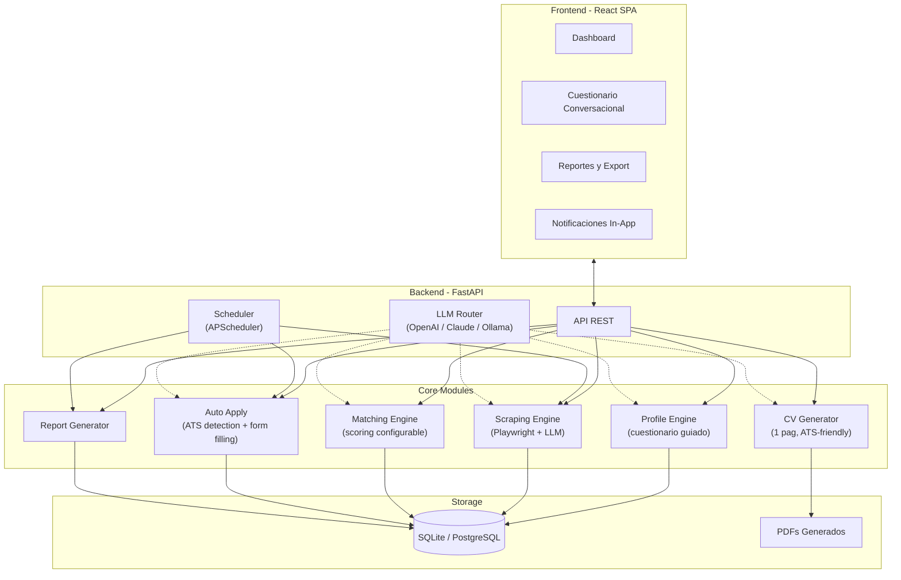

# Job Finder Bot - Scope

## Descripcion General

Bot automatizado de busqueda y postulacion laboral. El sistema recolecta informacion del usuario mediante un cuestionario conversacional guiado por IA, scrapea sitios de carreras de empresas especificas, genera CVs customizados de una pagina, y se postula automaticamente a posiciones donde el candidato sea un buen match.

---

## Stack Tecnologico

| Componente | Tecnologia |
|---|---|
| Backend | FastAPI (Python, async) |
| Frontend | React (SPA) |
| Base de datos | SQLite con SQLAlchemy (migrable a PostgreSQL) |
| Scraping | Playwright + LLM para interpretar contenido |
| LLMs | OpenAI, Claude (Anthropic), Ollama (local) - configurable por tarea |
| Generacion de PDF | WeasyPrint o ReportLab |

### Estrategia de LLM

El sistema soporta tres proveedores de LLM configurables **por tarea**:

- **OpenAI (GPT)**: Para tareas que requieren alta calidad de generacion (CVs, matching complejo)
- **Claude (Anthropic)**: Alternativa a OpenAI, misma categoria de uso
- **Ollama (local)**: Para tareas mas simples (parsing, extraccion de datos) sin costo de API

La configuracion se maneja via `.env` y permite asignar un modelo distinto a cada tipo de tarea (scraping, matching, generacion de CV, etc.). Se usara LiteLLM o una capa de abstraccion propia dado que Ollama expone una API compatible con OpenAI.

---

## Arquitectura

---

## Fases de Desarrollo

### Fase 1: Foundation

**Objetivo**: Establecer la base del proyecto y capturar el perfil completo del candidato.

**Entregables**:
- Setup del proyecto (FastAPI + React + SQLite)
- Schema de base de datos (usuarios, perfiles, skills, experiencias, estudios, preferencias)
- LLM Router con soporte para OpenAI, Claude y Ollama, configurable por tarea
- API REST base con autenticacion simple
- Cuestionario conversacional guiado por IA:
  - El agente sigue una estructura predeterminada para cubrir todas las areas (experiencia laboral, skills tecnicas y blandas, estudios, certificaciones, idiomas, preferencias salariales, modalidad de trabajo, ubicacion, personalidad/valores)
  - La interaccion es via chat natural (no formulario rigido)
  - Si el usuario aporta informacion adicional no prevista, el agente la captura y almacena
  - Follow-up questions inteligentes segun las respuestas del usuario

**Datos del perfil a recolectar**:
- Datos personales (nombre, contacto, ubicacion, disponibilidad para mudarse)
- Experiencia laboral (empresas, roles, duracion, logros cuantificables, tecnologias usadas)
- Educacion (titulos, instituciones, certificaciones, cursos relevantes)
- Skills tecnicas (lenguajes, frameworks, herramientas, nivel de expertise)
- Skills blandas (liderazgo, comunicacion, trabajo en equipo, etc.)
- Idiomas y nivel
- Preferencias laborales (modalidad remoto/hibrido/presencial, rango salarial, tipo de empresa, industrias de interes)
- Proyectos personales o open source relevantes
- Links (GitHub, LinkedIn, portfolio, etc.)
- Cualquier informacion adicional que el usuario quiera incluir

---

### Fase 2: Scraping

**Objetivo**: Recolectar posiciones abiertas de sitios de carreras de empresas especificas.

**Entregables**:
- Scraper con Playwright para navegar career pages (manejo de JS rendering, paginacion, lazy loading)
- Interpretacion de contenido via LLM (en vez de selectores CSS/XPath hardcodeados por sitio)
- Cache de resultados para minimizar consumo de tokens y requests
- Scheduling automatico configurable (APScheduler, frecuencia diaria por defecto)
- Modelo de datos para posiciones (titulo, empresa, descripcion, requerimientos, ubicacion, modalidad, seniority, url original)
- Deteccion de posiciones nuevas vs ya conocidas (deduplicacion)

**Consideraciones tecnicas**:
- Rate limiting: delays configurables entre requests
- Anti-deteccion: rotacion de user agents, delays aleatorios, fingerprint management
- Manejo de errores: retry logic, logging de fallos, alertas si un sitio cambia estructura
- El LLM recibe el HTML/texto de la pagina y extrae datos estructurados (titulo, descripcion, requerimientos, etc.)

---

### Fase 3: Matching

**Objetivo**: Comparar el perfil del candidato contra las posiciones recolectadas y determinar cuales son buen match.

**Entregables**:
- Motor de matching que compara skills, experiencia y preferencias del candidato vs requerimientos de la posicion
- Scoring numerico (0-100%) con desglose por categoria (skills tecnicas, experiencia, educacion, preferencias)
- Configuracion de agresividad: el usuario define el threshold minimo de match para postularse (ej: 60%, 75%, 90%)
- Justificacion del score: el sistema explica por que considera que el candidato es o no es buen match
- Filtros adicionales: modalidad, ubicacion, seniority, industria

**Logica de matching**:
- Skills requeridas vs skills del candidato (ponderadas por nivel de expertise)
- Anos de experiencia requeridos vs experiencia real
- Nice-to-have vs must-have (distinto peso en el scoring)
- Preferencias del usuario (remoto, rango salarial, etc.) como filtros eliminatorios
- El LLM complementa el matching basado en reglas con analisis semantico (ej: "React" y "React.js" son lo mismo)

---

### Fase 4: CV Generation

**Objetivo**: Generar CVs de una pagina customizados para cada posicion.

**Entregables**:
- Generador de CVs de 1 pagina en formato PDF
- Customizacion por posicion: enfatiza skills y experiencias relevantes para el puesto especifico
- Formato ATS-friendly (parseable por Applicant Tracking Systems)
- Multi-idioma: generacion en espanol o ingles segun el idioma de la posicion/empresa
- Template limpio y profesional
- Storage de CVs generados asociados a cada postulacion

**Criterios del CV**:
- Maximo 1 pagina
- Destacar experiencias y skills que matchean con la posicion
- Cuantificar logros cuando sea posible (datos del perfil)
- Sin informacion irrelevante para el puesto
- Formato consistente y legible por ATS (sin tablas complejas, sin graficos, fonts estandar)

---

### Fase 5: Auto Apply

**Objetivo**: Postularse automaticamente a las posiciones que superen el threshold de match.

**Entregables**:
- Deteccion de ATS conocidos con flows especificos:
  - **Lever**
  - **Greenhouse**
  - **Workable**
  - **Workday**
  - Otros que se identifiquen durante el desarrollo
- Para formularios custom (no-ATS): el LLM interpreta los campos del formulario y los completa con datos del perfil
- Upload automatico del CV generado
- Completado de campos tipicos (nombre, email, telefono, LinkedIn, etc.)
- Logging de cada postulacion (timestamp, posicion, empresa, CV usado, resultado del submit)
- Manejo de errores: si falla una postulacion, loggear y continuar con la siguiente

**Consideraciones**:
- Algunos sitios requieren crear cuenta: el bot debera manejar registro o el usuario provee credenciales
- CAPTCHAs: detectar y loggear como fallo (no intentar resolver automaticamente en primera instancia)
- Rate limiting por sitio para evitar bans
- El bot no se postula a la misma posicion dos veces

---

### Fase 6: Reporting y UI

**Objetivo**: Dashboard web con reportes, notificaciones y export de datos.

**Entregables**:
- **Dashboard**: vista general con metricas (postulaciones del dia, distribucion de scores, empresas top, posiciones nuevas)
- **Reporte diario de postulaciones** con:
  - Empresa y titulo de la posicion
  - Summary de requerimientos
  - Scoring de match (%) con justificacion de por que el bot considero al usuario buen candidato
  - CV generado para esa postulacion (link al PDF)
- **Notificaciones in-app**: badges/toasts en el dashboard post-ejecucion del bot (sin email/push por ahora)
- **Export de datos**: descarga en CSV o Excel con campos: empresa, titulo, % de match, summary del job description, link al CV generado (PDF aparte)
- **Historial**: listado completo de todas las postulaciones con filtros y busqueda

---

## Fuera de Scope (puede agregarse en el futuro)

- Cover letter generation
- Preparacion para entrevistas
- Blacklist/whitelist de empresas
- Salary intelligence (scraping de rangos salariales de Glassdoor, etc.)
- Follow-up automatico de estado de postulaciones (re-scrapeo de portales para ver si fue visto/rechazado/etc.)
- Notificaciones por email o push
- Soporte multi-usuario (la arquitectura se prepara para esto, pero v1 es single-user)
- Portales de empleo genericos (LinkedIn, Indeed, etc.) - solo career pages de empresas especificas
- Resolucion automatica de CAPTCHAs

---

## Consideraciones Transversales

- **Seguridad**: credenciales y API keys en `.env`, nunca en codigo. Datos sensibles del usuario encriptados en DB.
- **Logging**: logging estructurado en todo el sistema para debugging y auditoria.
- **Error handling**: el sistema debe ser resiliente. Si falla un scraping o una postulacion, loggea y continua.
- **Caching**: resultados de scraping cacheados para no re-procesar. CVs generados almacenados para reutilizacion.
- **Configurabilidad**: todo lo posible configurable via `.env` o settings en la UI (threshold de match, frecuencia de scraping, LLM por tarea, idioma preferido, etc.).
- **Arquitectura preparada para multi-user**: aunque v1 es single-user, el schema de DB y la API se disenan con user_id para facilitar la migracion futura.
